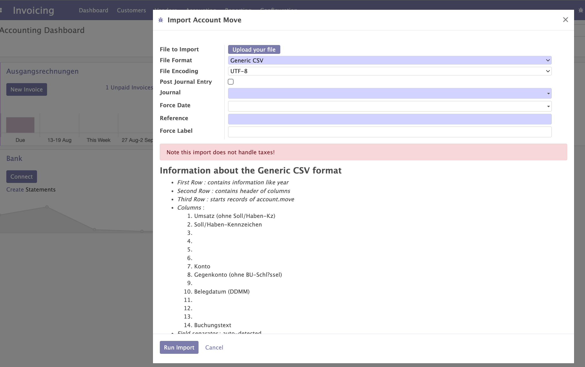
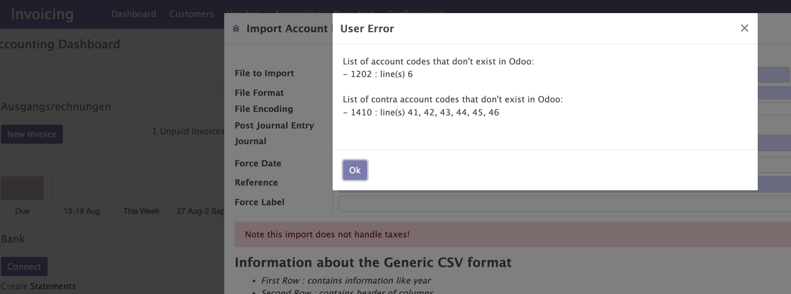

# Import from DATEV into Odoo

## Requirements

1.  Make sure your user has group 'Full accounting features'
2.  Check if the file you want to import into Odoo is DATEV format .csv
    (move lines start is line 3)
3.  Check the description in order to check if your use case is
    supported

## DATEV Import

1.  Go to Accounting/Actions/DATEV Import
2.  Upload your DATEV format .csv file from your tax advisor
3.  Take care the file format is "DATEV Format .csv" (old version:
    Generic CSV)
4.  Take care your file encoding fits to the provided file (usually
    "Western (Windows-1252)"), if it is the original file from your tax
    advisor
5.  Optionally you may activate "Post Journal Entry" in order to
    immediately confirm the created Journal Entry
6.  Select the mandatory journal (f.e. "Payroll Account Moves"), usually
    the journal type will be "Miscellaneous"
7.  Enter optionally the "Force Date" field (will be the field "Date"
    in your Journal Entry)
8.  Enter the mandatory field "Reference" (will be the field "Reference"
    in your Journal Entry)
9.  Enter optionally the field "Force Label" (will be the field "Name"
    in your Journal Items)
10. Optionally enable "Apply Account Default Taxes" to automatically
    generate tax lines (see below)
11. Finally click on "Run Import"

If everything works fine, you should now see your created Journal Entry
in draft (except you activated "Post Journal Entry")

## Tax handling (Automatikkonten)

When importing DATEV files that contain bookings on accounts with
default taxes (Automatikkonten), you can enable the "Apply Account
Default Taxes" checkbox in the import wizard. This will:

1.  Look up the default taxes configured on each account in Odoo
    (Accounting > Configuration > Chart of Accounts > Default Taxes)
2.  Treat the imported amounts as **gross** (tax-included)
3.  Automatically split the gross amount into net + tax using Odoo's
    tax engine
4.  Generate the corresponding tax lines on the journal entry

**Example:** A CSV row with 119.00 EUR on account 4400 (configured with
19% input VAT) will create:

- 100.00 EUR debit on account 4400 (net amount, with tax reference)
- 19.00 EUR debit on the input VAT account (auto-generated tax line)
- 119.00 EUR credit on the contra account (gross amount, unchanged)

**Prerequisites:** Ensure that the relevant accounts in Odoo have their
default taxes ("Default Taxes" / "Standardsteuern") configured correctly
before running the import.

Accounts without default taxes are imported as before (gross amount,
no tax split).

## Typical issue

If accounts don't exist in Odoo the wizard may interrupt and show you
potential missing accounts.

In this case you have to ensure to create the missing accounts in Odoo.
